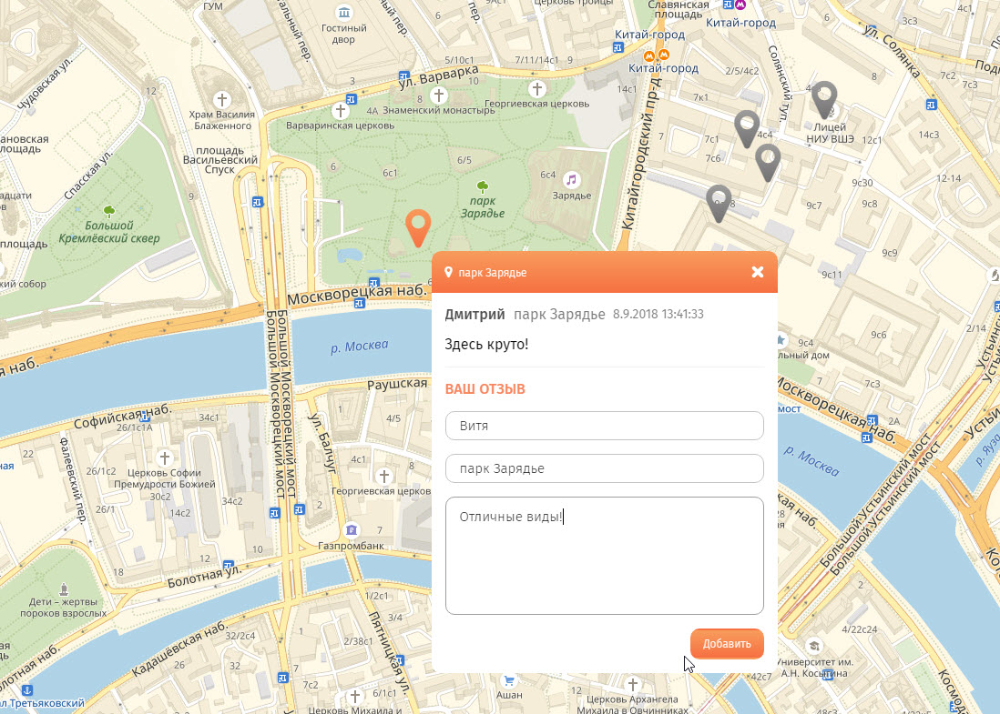

## LoftSchool геоотзыв

	

### Доступные команды

* `npm install` - установить зависимости
* `npm run start` - запустить встроенный сервер и следить за изменениями файлов
* `npm run build` - собрать проект в папку `build`

### Функционал

* Добавление метки на карту только после создания отзыва
* Просмотр отзывов по каждой метке
* Группировка меток в кластеры
* Drag'n'Drop всплывающего окна метки
* Сохранение добавленных меток после перезагрузки страницы

	

